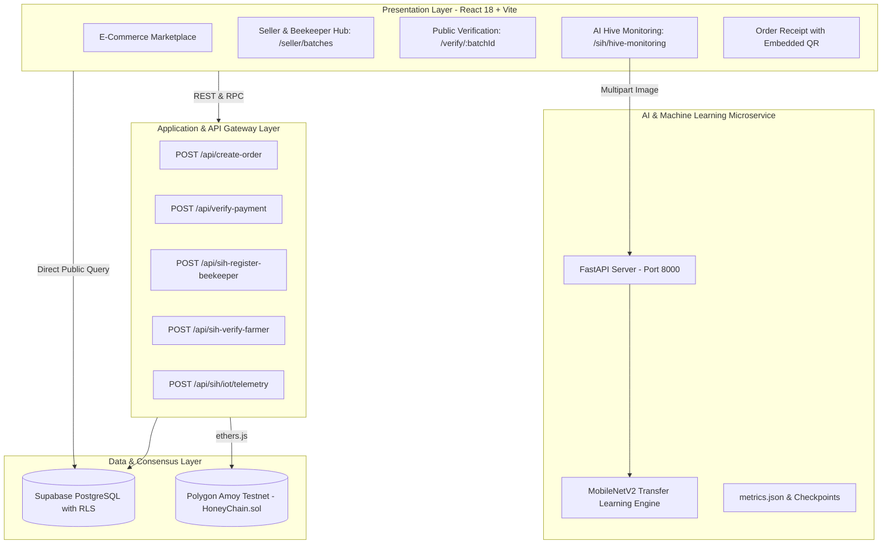

# 🏗️ SIH 2026 Bee Bridge — System Architecture

Comprehensive architectural documentation for SIH Problem Statement 26021.

---

## 1. Multi-Tier Layered Architecture

---

## 2. Security Boundaries & Zero-PII Policy

| Entity | Raw Value Location | On-Chain Stored Data | Security Measure |
| :--- | :--- | :--- | :--- |
| **Agriculture ID / Aadhaar** | Never stored in plaintext | SHA-256 Hash (`0x3f5b...`) | One-way hashing; impossible to reverse |
| **Beekeeper Phone / Email** | Protected by Supabase RLS | Excluded from Smart Contract | Accessible only to authenticated user |
| **Honey Batch Verification** | Off-Chain DB + On-Chain TX | Contract Batch Struct & Checkpoints | Canonical SHA-256 hash comparison |
| **Private Keys** | Server-side `.env` only | Never in git or client bundles | In `.gitignore` & serverless execution |

---

## 3. Data Integrity & Verification Protocol

When a customer visits `/verify/:batchId`, seven checks execute sequentially:
1. **Batch Code Regex:** Validates `^HB-\d{4}-\d{6}$`.
2. **Database Record Lookup:** Retrieves batch metadata from `sih_honey_batches`.
3. **Blockchain Confirmation:** Validates that transaction hash exists and has consensus on Polygon Amoy.
4. **Metadata Hash Check:** Recomputes `SHA-256(batchCode|hiveCode|variety|harvestDate|grade)` and verifies against recorded on-chain state.
5. **Farmer Proof:** Confirms farmer's Agriculture ID was verified by authorized authority.
6. **Hive Mapping:** Confirms hive ownership matches registered apiary.
7. **Certificate Rendering:** Displays certified authenticity shield or detailed failure reasons.
